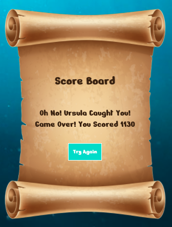

# Project 1: Little Mermaid Pacman

## GA SEI Project 1: Simple Front-End Game

You can find a hosted version of my game here : [Little Mermaid Pacman](https://elsiedown.github.io/SEI-project-1/)

## Overview

This was my first project on the General Assembly Software Engineering Immersive course.  After three weeks of learning, we were assigned a week-long individual project with the goal of building a single-page game using JavaScript, HTML and CSS. 

I decided to go with the classic arcade game Pacman,  adding a personal twist by choosing a Little Mermaid theme.  The aim of the game is for the Little Mermaid (Pacman) to pick up all the shells in the maze before the time runs out and without being hunted by Ursula (the ‘ghosts’). 

This Readme will outline the approach I took and the wins and challenges that I encountered along the way.


## Brief
* Render a game in the browser
* Design logic for winning & visuals display which player won
* Include separate HTML, CSS, JavaScript files
* Use Javascript for DOM manipulation
* Deploy your game online, using Github Pages, where the rest of the world can access it
* Use semantic markup for HTML and CSS

**Specific Game Brief:**
* The player should be able to clear at least one board
* The player’s score should be displayed at the end of the game
* Create 4 ghosts + create effective logic for the ghosts


## Timeframe and Technologies Used

**Timeframe:** 7 days

**Front End:**
* JavaScript (ES6)
* HTML5 & HTML5 Audio
* CSS3 with Animation

**Dev Tools:**
* VSCode
* Eslint
* Git
* GitHub
* Google Chrome Dev Tools
* Google Fonts

## Features and Pages
* Single Page Game
* Score Board with Timer and Lives
* Timers
* Restart Button
* Audio

## Game Instructions
1. The player (Ariel) has 60 seconds to clear the board, collecting all the shells before the time runs out and without being caught by the ghosts (Ursula).  For each shell collected, the player gets 20 points and 50 points for the starfishes.
2. To escape Ursula , Ariel can use the whirlpool warp holes to move from one side of the board to the other.
3. If Ursula catches Ariel, Ariel goes back to the beginning of the board and loses one life.
4. If all lives are lost or the time runs out, the game is over. The player can then play again. 
5. The score board displays the result and points scored at the end of the game.

## Approach Taken

* This section sets out the approach that I took and the problems which I encountered.

* I started by  mounting the grid, using JavaScript. I chose a 13x13 grid and applied different classes to the grid eg. For the walls, shells, whirlpools etc. 

* I then focused on the movement of Pacman, responding to the different arrow keys using a switch statement to make sure the player stayed within the grid and could move up, down, left and right.  The challenge I faced at this point was not only ensuring  that Pacman stayed on the board, but that the Pacman stayed within the maze grid and didn’t go ‘under’ the walls of the maze.

* I then worked on the ghost movement. At first, I aimed to generate a completely random movement for just one of the ghosts. Similar to Pacman, I used a switch statement to ensure the ghost stayed on the grid and within the maze path. Once I was happy with the random movement I decided to add the other ghosts. The easiest way to do this was by creating an array of objects of ghosts,  with different speeds, starting positions and timer IDs.  This took quite a while to put in place but then meant the function was reusable, passing in the different ghost indexes and resulting in the ghosts being added to the grid. 

* The final step was to generate an ‘intelligent’ ghost movement - where the ghosts were tracking Pacman. I did this by working out the current and new coordinates of the ghosts, as well as the current coordinates of Pacman and then compared the three coordinates.  I worked out that if the (Pac-Man coordinates - new ghost position coordinates) is smaller than (Pac-Man coordinates - current ghost position) then the ghost could move into the new position. Similarly, if the result of first calculation was greater than the second calculation, then the ghost should choose a different direction.

```
  //*   Find coordinates of characters
  
  function findCoordinates(index) {
    return [index % width, Math.floor(index / width)]
  }

  //*   Compare Coordinates to determine new ghost movement

  function compareCoordinates(index, newMovement) {
    const [currentGhostX, currentGhostY] = findCoordinates(ghosts[index].currentPosition)
    const [newGhostX, newGhostY] = findCoordinates(newMovement)
    const [arielX, arielY] = findCoordinates(arielPosition)
    if ((Math.abs(newGhostX - arielX) || Math.abs(newGhostY - arielY)) <= (Math.abs(currentGhostX - arielX) || Math.abs(currentGhostY - arielY))){
      newMovement
    } else if ((Math.abs(newGhostX - arielX) || Math.abs(newGhostY - arielY)) >= (Math.abs(currentGhostX - arielX) || Math.abs(currentGhostY - arielY))) {
      movement = randomMovement()
    }
  }

```

* After I was happy that I had achieved the above functionality, I moved onto styling my game.  I added in GIFS and effects (such as bubbles) for when the game was in play. The final thing I focussed on was the audio . I used 5 different audio clips from the Little Mermaid which I found on a movie sound database and I think they worked well -  there are audio effects for when the game is in play, when the player loses a life, and for all three different outcomes of the game - the player has won, the player has no lives left, and the player has run out of lives.

## The Game: 


**Game in Play**


**Score Boards**




## Wins

* As this was my first ever project using JavaScript, I was really happy with the final product. I also really enjoyed using CSS (something I was nervous about when starting the project) and felt the game looked fun and interesting. I was really happy with the layout and readability of my code.

## Challenges

* The main challenge that I encountered was coming up with the ghost movement and logic - and then applying this logic to the multiple ghosts. To do this, I refactored my code by creating an array of objects of ghosts which enabled me to apply the same logic to the multiple ghosts. I found the timers slightly difficult to implement, and I encountered a few bugs where they were going at the wrong speeds but was happy that they all seemed to be working by the end. 

## Future Features

* If I had more time, I would improve the ghost logic so that they would track Pacman in a more accurate way. I would have liked to add the functionality which enabled Pacman to eat food that would make the ghost run away.

* I would also have liked to added more levels - possibly with a more complex maze or with different timers used to make the game more challenging.

* It would have also been nice to use local storage in order for there to be a high score board.